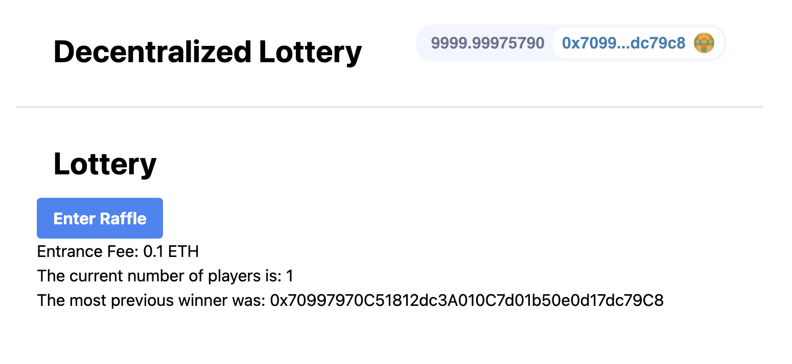

# NextJS Smartcontract Lottery

[Smartcontract Repo](https://github.com/kapildev5262/Fullstack-Hardhat-Smart-Contract-Lottery)



[Example App here!](https://fancy-dream-3458.on.fleek.co/)

Built with ❤️ using:
NextJS
Solidity
Chainlink
Moralis
web3uikit
Ethers
Hardhat

- [NextJS Smartcontract Lottery](#nextjs-smartcontract-lottery)
- [Getting Started](#getting-started)
  - [Requirements](#requirements)
  - [Quickstart](#quickstart)
  - [Formatting in VSCode](#formatting-in-vscode)
- [Usage](#usage)
- [Linting](#linting)
- [Thank you!](#thank-you)


# Getting Started

## Requirements

- [git](https://git-scm.com/book/en/v2/Getting-Started-Installing-Git)
  - You'll know you did it right if you can run `git --version` and you see a response like `git version x.x.x`
- [Nodejs](https://nodejs.org/en/)
  - You'll know you've installed nodejs right if you can run:
    - `node --version` and get an ouput like: `vx.x.x`
- [Yarn](https://yarnpkg.com/getting-started/install) instead of `npm`
  - You'll know you've installed yarn right if you can run:
    - `yarn --version` and get an output like: `x.x.x`
    - You might need to [install it with `npm`](https://classic.yarnpkg.com/lang/en/docs/install/) or `corepack`

## Quickstart

```
git clone https://github.com/kapildev5262/nextjs-smartcontract-lottery
cd nextjs-smartcontract-lottery
yarn
yarn dev
```

## Formatting in VSCode

To have VSCode extension prettier auto-format `.jsx` and `.tsx`, add the following to your settings.json file:

```
  "[javascriptreact]": {
    "editor.defaultFormatter": "esbenp.prettier-vscode"
  }
```

# Usage

1. Run your local blockchain with the lottery code

> In a different terminal / command line

```
git clone https://github.com/kapildev5262/Fullstack-Hardhat-Smart-Contract-Lottery
cd Fullstack-Hardhat-Smart-Contract-Lottery
yarn 
yarn hardhat node
```

> You can read more about how to use that repo from its [README.md](https://github.com/kapildev5262/Fullstack-Hardhat-Smart-Contract-Lottery/blob/main/README.md)


2. Add hardhat network to your metamask/wallet

- Get the RPC_URL of your hh node (usually `http://127.0.0.1:8545/`)
- Go to your wallet and add a new network. [See instructions here.](https://metamask.zendesk.com/hc/en-us/articles/360043227612-How-to-add-a-custom-network-RPC)
  - Network Name: Hardhat-Localhost
  - New RPC URL: http://127.0.0.1:8545/
  - Chain ID: 31337
  - Currency Symbol: ETH (or GO)
  - Block Explorer URL: None

Ideally, you'd then [import one of the accounts](https://metamask.zendesk.com/hc/en-us/articles/360015489331-How-to-import-an-Account) from hardhat to your wallet/metamask. 

3. Run this code

Back in a different terminal with the code from this repo, run:

```
yarn dev
```

4. Go to UI and have fun!

Head over to your [localhost](http://localhost:3000) and play with the lottery!

# Linting

To check linting / code formatting:
```
yarn lint
```


# Thank you!

[](https://www.linkedin.com/in/kapil-dev-b90629290/)

